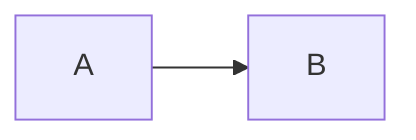

# 中文标题

#### 四级标题

##### 五级标题

###### 六级标题

这是一个包含 **GFM** 语法的共享 fixture。

| 名称 | 状态 |
| --- | --- |
| 一 | ✅ |

- [x] 已完成
- [ ] 待完成

1. 外层
   1. 内层
   2. 第二项

脚注示例[^note]。

[^note]: 这是脚注内容。

<iframe src="https://evil.example/embed"></iframe>

